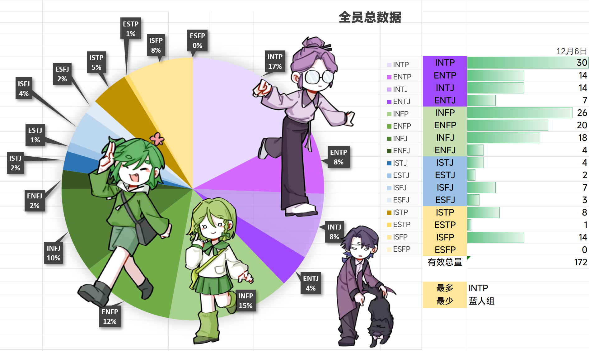
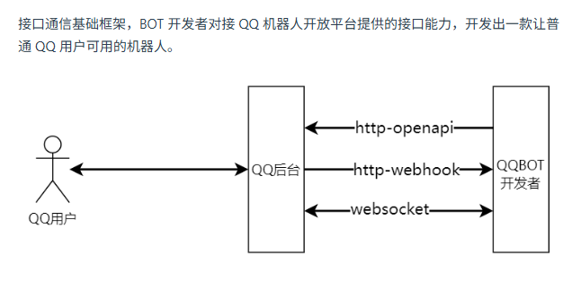

# MBTI 统计机器人 - 项目开发文档

> 这份文档是为开发者和 IDE AI 助手准备的。它清晰地定义了项目的上下文、技术栈以及部署流程。

## 1. 项目背景与功能
本项目旨在开发一个 QQ 机器人，用于自动化统计群成员的 MBTI 人格分布
（基于群成员的呢称里自己声明/标注的MBTI类型，支持 MBTI 16型，扩展型（一般包含 4 字母代码，故可用相同逻辑检测），模糊型（用字母X代替其中的若干字母），OPS 类型（不包含通用 MBTI 4 字母代码，需要单独检测））
*   **核心痛点**：替代人工手动统计；避免 Matplotlib 等面向科研的库出图审美枯燥的问题。
*   **主要功能**：
    1.  **指令触发**：接收群指令
        * `/类型统计`：统计当前群的 MBTI 16 类型分布。
        * `/特质统计`：统计当前群的 MBTI 4 特质维度（E/I, S/N, T/F, J/P）分布。
        * `/帮助` 或 `/help`：显示帮助信息。
    2.  **数据抓取**：获取群成员列表，解析群名片中的 MBTI 关键词。
    3.  **高颜值绘图**：生成带有较精美风格的图表。
        > 其中饼状图部分带有文字标签（如："INTP 73人\n13%"），同时对主要类型附加对应漫画形象图（覆盖在饼状图上）；需要自动排布图表的文字标签和漫画形象，防止重叠。
    4.  **消息回复**：将生成的图片发送回 QQ 群。
    5.  **数据持久化**：在腾讯云函数缓存里缓存图片和统计数据，以便在统计数据不变时使用缓存，减少重复计算。（缓存只能用于图片渲染加速；未来如果需要提供时间线信息等功能，可能需要使用数据库来持久化数据）
*   **平台**：基于 QQ 机器人官方开放平台（QQ Open Platform），以及腾讯云函数（SCF）。

可以参考之前群友人工统计时用 Excel 表格出的图表示例：



## 2. 技术架构

*   **编程语言**：Python 3.13 (通过 Docker 镜像实现，不受云端限制)。
*   **Bot 框架**：QQ 机器人官方开放平台（QQ Open Platform） + `NoneBot2` + `nonebot-adapter-qq` (官方适配器)。
*   **绘图方案**：使用无头浏览器和 web 前端工程渲染图表。
    *   **前端**：HTML + ECharts (负责布局、逻辑计算、防重叠)。
    *   **渲染**：Playwright (Python) 调用 Headless Chromium 进行截图；使用 Jinja2 模板引擎渲染 HTML 模板。
*   **依赖管理**：`uv` (接替 pip/poetry)。
*   **部署环境**：腾讯云云函数 (SCF) - Web 函数模式 + **自定义镜像模式 (Custom Image)**。
    > 由于腾讯云 SCF 基础环境限制（CentOS 7/glibc 版本过低），本项目采用 **Docker 容器化部署** 方案。将 Docker 镜像推送到腾讯云镜像仓库（TCR），然后腾讯云函数（SCF）使用该镜像部署。
    > 腾讯云 SCF 对自定义镜像模式的限制为解压前大小不超过 1 GB。粗略计算，官方 Python Slim 基础镜像 (~120MB) + Chromium (~300MB) + 依赖库 + 字体，通常总大小在 600MB-800MB 左右，是可以塞进去的。

QQ 机器人官方开放平台（QQ Open Platform）使用 Webhook API 方式运行 Bot 应用，需要提供一个 Web 服务来接收 QQ 的回调请求，架构如图（其中 Websocket 部分已不再被支持）。



注：开发者熟悉 python, 前端, 但不太熟悉 Docker, 腾讯云 SCF, nonebot, playwright 等，需要在开发时学习相关知识。

## 3. 开发环境配置 (基于 uv)
本项目使用 `uv` 进行包管理，确保依赖版本锁定。

```bash
# 1. 初始化/同步依赖 (根据 pyproject.toml 和 uv.lock)
uv sync

# 2. 安装 Playwright 浏览器内核 (本地开发必做)
uv run playwright install chromium

# 3. 本地运行 Bot
# 确保配置好 .env 文件中的 QQ_APP_ID 和 QQ_TOKEN
uv run bot.py
```

## 4. 前端模板文件开发预览

用于开发时预览前端模板文件的渲染效果。
```bash
uv run debug_frontend.py
```

脚本将持续监听前端模板文件的变化，并自动使用 mock 数据渲染至 `template/preview.html` 文件。然后可以使用 Live Server 打开 `template/preview.html` 文件，实时预览渲染效果。

## 5. Docker 部署工作流 (Cheat Sheet)

### 4.1 核心配置信息
*   **Dockerfile**：已配置为基于 `python:3.13-slim`，集成 `uv` 和 `chromium`。
*   **腾讯云仓库 (TCR)**：你需要替换下方的 `<namespace>` 和 `<repo_name>`。
    *   示例地址：`ccr.ccs.tencentyun.com/<namespace>/<repo_name>`
    *   目前暂时使用：`ccr.ccs.tencentyun.com/sirilit/mbtistats-bot`
    *   不使用像 `.env.prod` 这样的面向生产环境的配置文件。直接使用腾讯云 SCF 配置界面参考 `.env.example` 来手动配置所有环境变量。`.env` 文件仅用于本地开发环境使用。

### 4.2 常用指令片段

**场景 A：本地模拟运行 (测试 Docker 环境)**
```bash
# 1. 构建镜像 (本地标签)
docker build -t mbtistats-bot-local .

# 2. 运行容器 (映射端口 9000)
# 访问 http://localhost:9000 验证服务是否启动
docker run -p 9000:9000 --env-file .env mbtistats-bot-local
```

**场景 B：发布到腾讯云 SCF**
```bash
# 变量定义 (请替换为实际值)
export TCR_URL="ccr.ccs.tencentyun.com/<你的命名空间>/<你的仓库名>"
export VERSION="v1.0.0"  # 建议每次递增版本号

# 1. 登录腾讯云镜像仓库 (仅需执行一次)
# 密码在腾讯云控制台 -> 容器镜像服务 -> 访问凭证 中设置
docker login ccr.ccs.tencentyun.com --username=<你的腾讯云账号ID>

# 2. 构建并打标签 (针对云端)
# 注意命令最后有一个点 "."
docker build -t $TCR_URL:$VERSION .

# 3. 推送镜像到腾讯云
docker push $TCR_URL:$VERSION

# 4. 部署后续
# 推送成功后，前往腾讯云 SCF 控制台 -> 函数服务 -> 镜像配置 -> 点击“更新镜像”并选择刚才推送的版本。
```

## 5. 目录结构说明
```text
.
├── Dockerfile          # 构建脚本 (Python 3.13 + uv + Playwright + Chromium + 字体依赖 Fonts)
├── pyproject.toml      # 依赖定义
├── uv.lock             # 依赖锁定
├── .env                # 本地环境变量 (不要提交到 git)
├── src/                # 源代码
│   ├── main.py         # 入口文件 (监听 0.0.0.0:9000)
│   └── ...             
└── templates/          # 存放 ECharts 绘图用的 HTML 模板
    └── chart.html
```